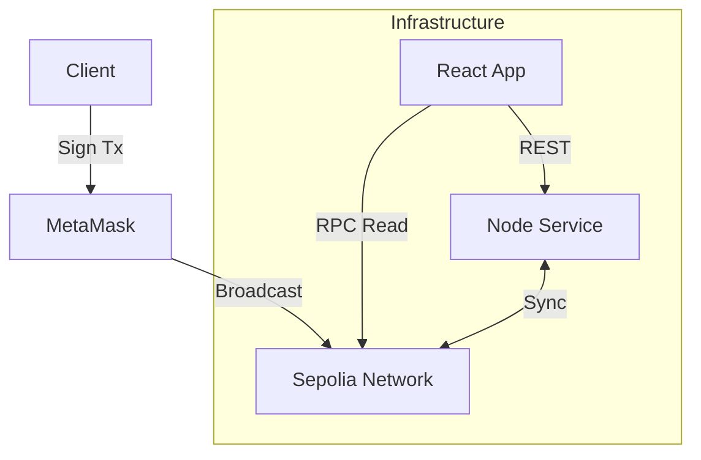

# Democrazy - Decentralized Voting Platform


## Technical Overview

Democrazy is a decentralized application (dApp) deployed on the Sepolia Testnet that facilitates on-chain governance. It utilizes an Ethereum smart contract for state persistence and immutable vote recording, ensuring censorship resistance and auditability. The frontend acts as a Web3 interface, managing wallet connections and transaction signing via `ethers.js`.

## Technologies Used

*   **Smart Contracts**: Solidity (0.8.x), Hardhat
*   **Frontend**: React.js, Ethers.js (v6), CSS Modules
*   **Backend**: Node.js, Express.js
*   **Database**: MongoDB (Caching)
*   **Network**: Ethereum Sepolia Testnet

## System Architecture

The stack follows a standard Web3 injection pattern with an auxiliary backend for data aggregation.

### 1. Smart Contract Layer
*   **Network**: Sepolia Testnet (ETH).
*   **State Management**: On-chain storage of `Proposal` structs and `Vote` mappings.
*   **Access Control**: Public interfaces for `createPoll` and `vote`; logical constraints prevent double-voting (`msg.sender` validation).
*   **Events**: Emits `ProposalCreated` and `VoteCast` for external indexing.

### 2. Frontend Client
*   **Framework**: React.js SPA.
*   **Web3 Provider**: `ethers.js` (BrowserProvider/Signer).
*   **Transaction Handling**: optimistic UI updates with eventual consistency checks against blockchain confirmations.
*   **Styling**: Specialized CSS Modules (Scoped) ensuring high-performance rendering without external UI libraries.

### 3. Backend Service
*   **Runtime**: Node.js / Express.
*   **Function**: Caches blockchain state to reduce RPC read latency.
*   **Database**: MongoDB (Structure compliant with on-chain schema).



## Core Capabilities

### on-Chain Logic
*   **Immutable State**: All governance data is stored permanently on the Ethereum ledger.
*   **Gas Optimization**: Utilizes `uint256` packing and `mapping` lookups (< O(n) complexity) to minimize transaction costs.
*   **Atomic Transactions**: Voting operations are atomic; failure in execution reverts the entire state change.

### Client-Side Security & Logic
*   **Input Sanitization**: Implements regex-based heuristic filtering to validate payloads before transaction construction.
*   **Event Listening**: Subscribes to websocket-based blockchain events for real-time state hydration.
*   **Wallet Integration**: Native support for EIP-1193 providers (MetaMask, etc.).

## File Structure

```text
agtest/
├── backend/                       # Node.js Express Server (Caching & API)
│   ├── models/                    # Mongoose Data Schemas
│   │   └── Poll.js                # Schema for off-chain poll metadata
│   ├── routes/                    # API Endpoints
│   │   └── polls.js               # Routes for CRUD operations on polls
│   ├── server.js                  # Entry point (DB connection, Middleware)
│   └── .env                       # Backend Config (Port, MongoURI)
│
├── frontend/                      # React Application (User Interface)
│   ├── src/
│   │   ├── components/            # Functional UI Components
│   │   │   ├── PollList.js        # Dashboard displaying active proposals
│   │   │   ├── PollDetail.js      # Individual poll view & voting interface
│   │   │   ├── CreatePoll.js      # Form for initializing new proposals
│   │   │   └── AboutPage.js       # Static informational page
│   │   ├── styles/                # Component-Scoped CSS Modules
│   │   │   ├── AppShell.css       # Layout, Navigation, and Footer styling
│   │   │   ├── PollListModern.css # Styling for grid layout and cards
│   │   │   ├── PollDetailModern.css # Styling for voting & results
│   │   │   └── CreatePollModern.css # Styling for the creation form
│   │   ├── utils/                 # Logic Helpers
│   │   │   └── contentFilter.js   # Regex-based content moderation
│   │   ├── App.js                 # Main Router, Web3 Provider, & Navbar
│   │   └── index.css              # Global Design System (Variables, Reset)
│   └── .env                       # Frontend Config (Contract Address)
│
└── smart-contract/                # Hardhat Development Environment
    ├── contracts/                 # Solidity Sources
    │   └── Voting.sol             # Main Governance Contract
    ├── scripts/                   # Automations
    │   └── deploy.js              # Network deployment script
    ├── hardhat.config.js          # Compiler & Network Configuration
    └── .env                       # Secrets (Private Key, RPC URL)
```

## Deployment Specifications

### Prerequisites
*   Node.js v16+
*   Sepolia RPC URL & Funded Wallet

### 1. Backend Service
```bash
cd backend
npm install
npm start
# Requires .env: PORT, MONGO_URI
```

### 2. Smart Contract
```bash
cd smart-contract
npm install
npx hardhat run scripts/deploy.js --network sepolia
# Requires .env: PRIVATE_KEY, SEPOLIA_URL
```

### 3. Client Application
```bash
cd frontend
npm install
npm start
# Requires .env: REACT_APP_CONTRACT_ADDRESS
```

